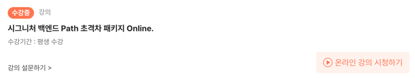
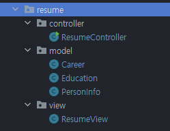
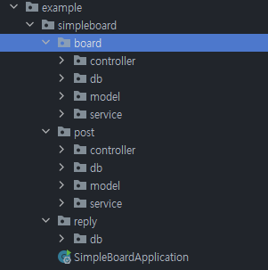

혼자서 프로그래밍 공부를 하면서... 책으로만 하다보니 진도도 안나가고 별로 흥미가 없었다...
사실 나의 노력과 의지 부족이다...😢

그러다 지인의 추천으로 패스트 캠퍼스라는 온라인 강의 사이트를 알게되었고, 하나의 온라인 강의로 자바의 기초부터 스프링의 활용까지 배울 수 있는 **시그니처 백엔드 Path 초격차 패키지**를 결제하게 되었다!



## 수강 후기

아직은 완강을 한게 아니라 좋은지 나쁜지 판단할 수 없지만, 혼자할 때 보다 뭔가를 만들면서 배우다 보니 신기하기도 하고 흥미가 생기는 것 같다.

### 자바 강의

자바는 기초부터 객체지향, API 활용까지 배울 수 있었다.
자바의 기초는 책과 다른 강의를 통해 배운적이 있어, 대부분은 넘어가고 객체지향부터 들었다.

내가 작성하던 자바 코드는 절차지향 코드에 가까웠다...(사실 절차지향도 아니고 내맘대로 코드다...)
객체 지향을 통해 얻을 수 있는 효과와 어떤 고민을 해야하는지.. 살짝이나마 느낄 수 있었다.
강의를 통해 자바를 활용하는 여러가지 기능을 사용해볼 수 있었다.
- Excel API(POI)를 활용해서 Excel에 회원 정보 저장하기
- Gson과 Jsoup을 활용한 날씨 정보 가져오기
- MVC 패턴을 활용한 애완동물 진료관리 애플리케이션 만들기
- 카카오 REST Open API 활용하기

마지막으로 이력서 자동생성 프로그램을 만들어봤다.



과제로 진행한 이력서 자동생성 프로그램의 패키지 구조이다.
MVC 패턴을 배우고 처음으로 목적에 맞게 패키지를 분리하고, 패키지에 맞는 역할의 클래스를 만들기위해 고민했던것 같다.
실제 코드를 보면... 형편 없지만 그래도 처음으로 혼자서 뭔가를 만들어본다는거에 뿌듯함이 있었다. 

### 스프링 강의

현재는 스프링 강의를 듣고 있다!

아직 전체 강의 중 절반정도밖에 못들었지만, Web부터 Rest API, DB를 배울 수 있었다.
DB같은 경우 SQL을 사용하는 MyBatis부터 ORM인 JPA의 기초를 배울 수 있었다.

#### 게시판 프로젝트

강의에서는 간단한 프로젝트로 게시판을 만든다.
- 게시판 시스템을 설계하고
- 직접 테이블도 설계했다.
- 테이블을 기반으로 Entity를 개발하고
- MVC 패턴을 적용한 API를 개발했다.

- JPA 연관관계를 설정하면서 머리 터질뻔했다...
  - 너가 One? 내가 One? 너 다해..
- 결과적으로 따라하기 급급했지만 완성된 프로젝트를 보면 한상 뿌듯하다!!

```text
전체적으로 단순 개념과 활용법을 알려주는 강의가 아니라
개념과 활용법을 배운 다음에 결과적으로 뭔가를 직접 만들어 본다는 점에서 재미있게 강의를 수당할 수 있었다.

또한, 개념만 들었을 때는 이해가 안되던 부분들이 프로젝트를 진행해보며 결과를 눈으로 확인한 후 다시 개념을 들어봤을 때는
"앗!! 이래서 내가 만들었을 때, 그런 결과가 나왔던 거구나.." 하고 이해가 되는 부분들도 많았다.
```

## 앞으로의 목표

아직 절반 부분이고 모두다 이해하지 못했지만 무제한 수강할 수 있는 강의기 때문에 여러번 반복해서 보면... 언젠간 이해가 되지 않을까...?

커리큘럼을 봤을 때는, 단순하게 Spring만 하는게 아니라 대용량 데이터 처리와 트래픽 처리, DevOps 등 백엔드 개발자로써 갖춰야할 다양한 기술들을 습득하고 활용할 수 있을 때 까지 완강을 목표로 열심히 수강해야겠다!

항상 뭔가 결과물로 프로젝트를 진행해서 그런지 너무 재미있게 강의를 수강할 수 있었다.

## 기대평

처음들어보는 기술? 기능?들이 대부분이지만 새로운 기술들을 배우고, 배운 기술들을 활용해볼 수 있다는 점에서 앞으로의 강의들도 기대된다.
패스트캠퍼스에는 대용량 처리와같은 특정 상황에 대해 전문적인 강의들도 추후 듣고싶다는 생각이 많이 들었다! 
